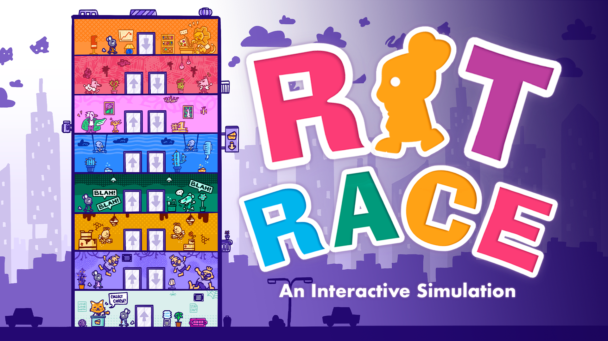

# [RAT RACE!](https://doityourseph2.github.io/rat-race/)

Made with p5.js and [p5play](https://p5play.org).

An interactive simulation representing our shared corporate struggles through animals to encourage discussion.
Tapping into our shared obsession of the self-defeating pursuit of money, power, and status... our struggles are simulated within this artwork, with a light-hearted tone in mind.

By incentivizing users to reward the rats within the simulation, we invite them to question the worth of the corporate rat race’s rewards and the inevitabilities the experience entails.

More info: https://doityourseph.com/#/projects/rat-race
